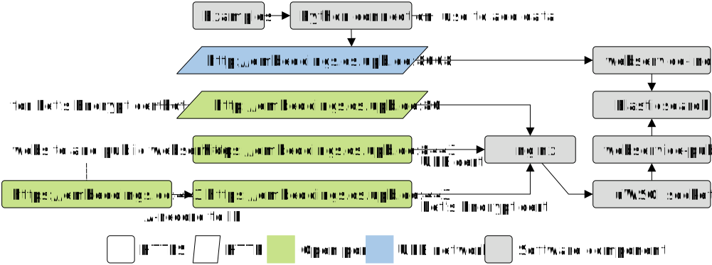

Note: This project was developed while working on the article ***Universal Knowledge Graph Embeddings*** (repository: ([https://github.com/dice-group/Universal_Embeddings], publication [link](https://dl.acm.org/doi/10.1145/3589335.3651978))).

# Universal Knowledge Graph Embeddings

This repository contains code to run [embeddings.cc](https://embeddings.cc/) and [embeddings.cs.upb.de](https://embeddings.cs.upb.de:8443/) ([also without TLS](http://embeddings.cs.uni-paderborn.de/)).


## Documentation


### Public API (for users)

- The API is documented at [embeddings.cc/api](https://embeddings.cc/api)
- Additional examples are provided in [Python examples](api/embeddings_cc_public_examples.py) and [JavaScript HTML form](api/embeddings_cc_public.htm)


### Index API (for data developers)

- Use the Index API to create Elasticsearch indexes and to **add data**.
- It is only available in UPB network (use **VPN**).
- It can easily accessed using the methods in [API python file](api/embeddings_cc_index.py).  
  Usage examples are provided in the files for [simple examples](api/embeddings_cc_index_examples.py),
  in the [adding CSV](api/embeddings_cc_index_csv.py) and
  in the [adding UniKGE data](api/embeddings_cc_index_unikge.py).
- **Important**: Create an alias for each index to be available in public. Only aliases can be accessed by webservices.

| Webservice             | Method | Parameters                          |
|------------------------|--------|-------------------------------------|
| /ping                  | GET    | -                                   |
| /count                 | GET    | index                               |
| /get_embeddings        | GET    | index, entity                       |
| /get_cpu_usage         | POST   | password                            |
| /get_indexes           | POST   | password                            |
| /create_index          | POST   | password, index, dimensions, shards |
| /create_index_usagelog | POST   | password                            |
| /delete_index          | POST   | password, index                     |
| /add                   | POST   | password, index, docs               |
| /alias_put             | POST   | password, index, alias              |
| /alias_delete          | POST   | password, index, alias              |


### Development (for python developers)

#### Quick start for Linux
This part helps you train embeddings for your knowledge graph, serve these embeddings on the embeddinng.cc API then query for embeddings via http requests or via a web browser. Please follow instructions carefully.

1. Clone this repository: `git clone https://github.com/dice-group/embeddings.cc.git`

2. Create an empty directory `/data` under this repository. Add your knowledge graph as `train.txt` into `/data`. You may additionally add `valid.txt` and `test.txt`, see [dice-embeddings](https://github.com/dice-group/dice-embeddings) for more details. For the next steps, you may need to make sure all Shell files are executable. You may need to assign appropriate rights for this, e.g., `chmod +x ./tain.sh`.

3. From the main directory, run `./install.sh` to install all required libraries. Note that a new environment (`embcc`) will be created on which libraries are installed. So you do not need to create a new one. It is recommended to deactivate any conda environment before this installation.

4. From the main directory, run `./train.sh` to compute embeddings for your knowledge graph. Steps 1 to 4 are summarized as:

```bash
eval "$(conda shell.bash hook)"
echo "before calling source: $PATH"
git clone https://github.com/dice-group/embeddings.cc.git && cd embeddings.cc
conda create -n embcc python=3.10 --y
conda activate embcc
echo "after calling source: $PATH"
python -m pip install -r requirements.txt
mkdir -p instance
cp -f ./config.py instance
wget https://artifacts.elastic.co/downloads/elasticsearch/elasticsearch-8.3.3-linux-x86_64.tar.gz
wget https://artifacts.elastic.co/downloads/elasticsearch/elasticsearch-8.3.3-linux-x86_64.tar.gz.sha512
shasum -a 512 -c elasticsearch-8.3.3-linux-x86_64.tar.gz.sha512 
tar -xzf elasticsearch-8.3.3-linux-x86_64.tar.gz
wget https://files.dice-research.org/datasets/dice-embeddings/KGs.zip --no-check-certificate && unzip KGs.zip && rm -rf KGs.zip
dicee --dataset_dir KGs/UMLS --model DeCaL --num_epochs 1 --batch_size 512 --path_to_store_single_run ./embeddings --save_embeddings_as_csv --eval_model "None" --embedding_dim 64

```

5. Open a new terminal, navigate to the main directory (embeddings.cc). Run `./commands/start_es.sh` to start Elasticsearch. This automatically sets the default user as `elastic` and a password. The next step describes how you can change the password. Note that the username will remain unchanged for our running example.

6. From the main directory, run `./elasticsearch-8.3.3/bin/elasticsearch-reset-password --username elastic --interactive` to provide a new password and confirm. Now keep this password safe, or remmeber it for the next steps.

7. Edit the file `/commands/upload.sh` by replacing "EasyPass" with the password you just selected.

8. Run `conda activate embcc && python ./scripts/generate-salt-password.py <PASSWORD>`. Note that `PASSWORD` must be the one you created in Step 6 above. Here you will get two outputs: values for `SALT` and `PSW_SALT_HASH`. Copy them to a safe place for the next step.

9. Edit the file `config.py` which is located in `embeddings_cc/instance`. ES_USER is `elastic`. ES_HOST is `https://localhost:9200/`. ES_PASSWORD is the password in Step 6. ES_INDEX is the index you are willing to create (in our example, the index is "index_example" as can be seen in the config file. If you use a different index name, make sure you use it in both `/instance/config.py` and `api/embeddings_cc_index_upload.py`). Set values for `SALT` and `PSW_SALT_HASH` as generated in Step 7.

10. Run `./run.sh` and wait until 3 pop up terminals have opened, and the third one (for uploading embeddings) has completed.

11. Now access the URL [http://127.0.0.1:1337/](http://127.0.0.1:1337/) to access the embeddings_cc API with your uploaded embeddings.

*HTTP Requests to the API*:

```python
>>> import httpx
>>> index = "index_example"
>>> entity = "_derivationally_related_form"
>>> webservice_url = "http://127.0.0.1:8008"
>>> response = httpx.get(webservice_url + '/get_embeddings', params={'index': index, 'entity': entity})
>>> print(response.text)
{"_derivationally_related_form": [[0.05112762, -0.7333016, 0.021954058, -0.016982945, -0.79204845, 0.0027191583, 1.0582609, -0.035856135, 0.004805608, 0.23186462, -0.00032222472, -0.38192114, -0.1920939, 0.8178917, -0.37373748, 0.28562018, 0.033060074, 0.0044505247, -0.85810864, -0.8185167, 0.021285398, -1.9875485, -1.4432987, -0.42645997, -0.08704758, -0.09042055, 0.008345734, 0.13854085, 0.00014656025, -0.61636055, 0.0014690972, -0.00089473446, -0.06372755, 0.029681738, 0.02126768, 0.033864107, 1.9365994, 0.0007361686, 0.8378815, -0.3289622, 0.02990957, -0.3481966, -0.014761708, -1.4790889, -0.39987803, 0.66778237, 0.37295908, 0.07800242, 0.19964921, 0.015911236, -1.2357806, 2.307485, 0.010366534, -2.453191, -0.9509186, -1.5705742, 0.27018142, 0.040954825, -0.025361957, 1.1823225, -0.027570289, 0.9071816, -0.22726324, -0.031022083]]}
>>>
```

#### Complete Documentation

- [How to install on your system](docs/local.md)
- [Development](docs/development.md) (External documentation of integrated components)


##### Virtual machine (for system administrators)

- [Virtual machine](docs/vm.md) (Installation and deployment)
- [VM nginx](docs/vm-nginx-certbot.md) (Webserver configuration)
- [Deployment](docs/deployment.md) (How to publish a new version)
- Note: This is an extension of [kg-embedding-service](https://github.com/dice-group/kg-embedding-service)


