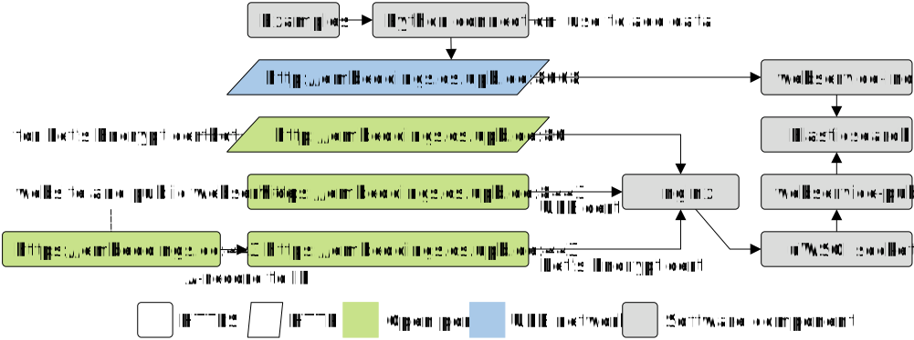

# Universal Knowledge Graph Embeddings

This repository contains code to run [embeddings.cc](https://embeddings.cc/) and [embeddings.cs.upb.de](https://embeddings.cs.upb.de:8443/).

## Documentation

### Public API (for users)

| Webservice            | Method | Parameters |
|-----------------------|--------|------------|
| /api/v1/ping          | GET    | -          |
| /api/v1/get_entities  | GET    | -          |
| /api/v1/get_embedding | GET    | entity     |
| /api/v1/get_similar   | GET    | embedding  |

### Index API (for universal embeddings developers)

- Use the Index API to create Elasticsearch indexes and to add data.
- The API is only available in UPB network (use VPN).
- The API can easily accessed via a [python file](api/embeddings_cc_index.py).
- Usage examples are provided in an [example python file](api/embeddings_cc_index_examples.py).
- To check, if the webservice and Elasticsearch are running, use the [ping webservice](http://embeddings.cs.uni-paderborn.de:8008/ping).

| Webservice      | Method | Parameters                          |
|-----------------|--------|-------------------------------------|
| /ping           | GET    | -                                   |
| /count          | GET    | index                               |
| /get_embeddings | GET    | index, entity                       |
| /get_indexes    | POST   | password                            |
| /create_index   | POST   | password, index, dimensions, shards |
| /delete_index   | POST   | password, index                     |
| /add            | POST   | password, index, docs               |

### System administration

- [Virtual machine](docs/vm.md) (Installation and deployment)
- [VM nginx](docs/vm-nginx-certbot.md) (webserver configuration)
- [Development](docs/development.md) (Used python modules)
- Note: This is an extension of [kg-embedding-service](https://github.com/dice-group/kg-embedding-service)

